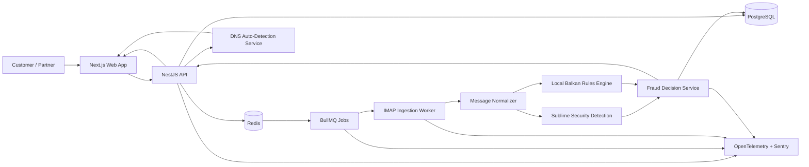

# emailShield Architecture Deep Dive

This document turns the locked product decisions into an implementation architecture for the MVP. It reflects the current constraints:

- IMAP first, OAuth later
- No MX changes in v1
- Sublime Security as the main detection engine
- DNS-based onboarding auto-detection
- A small curated set of Balkan fraud rules
- Partner-led go-to-market with tenant management support

## 1. Architecture Goals

- Detect invoice fraud with low onboarding friction
- Keep the MVP narrow enough to ship quickly
- Preserve a clear audit trail for every alert and override
- Support multi-tenant isolation from day one
- Allow partner-led onboarding without giving partners full super-admin power

## 2. System Overview

emailShield is a multi-tenant SaaS that sits beside customer mailboxes rather than routing mail through itself. It connects directly to each mailbox over IMAP, normalizes messages, sends them through Sublime Security plus local business rules, and stores the resulting fraud events, alerts, and audit entries in PostgreSQL.

The product is split into four main planes:

1. Experience plane: Next.js web app for customers and partners
2. Control plane: NestJS APIs for tenants, users, mailboxes, rules, and alerts
3. Processing plane: BullMQ jobs for ingestion, normalization, and detection
4. Data plane: PostgreSQL, Redis, and Sublime-backed detection logic

## 3. High-Level Diagram

## 4. Core Services

### 4.1 Next.js Web App

The web app handles:

- Signup and onboarding
- DNS-based provider detection presentation
- Mailbox connection setup
- Approved bank account management
- Alert review and override workflows
- Partner tenant management
- English and Macedonian UI

The web app should stay mostly presentational and call the NestJS API for all state changes.

### 4.2 NestJS API

The API is the source of truth for product state and tenant authorization. It owns:

- Authentication and role-based access control
- Tenant creation and partner attribution
- Mailbox configuration
- Approved bank account registry
- Fraud event persistence
- Alert and override workflow
- Audit logging
- Partner tenant management permissions

### 4.3 IMAP Ingestion Worker

This worker polls customer mailboxes through IMAP, fetches new messages, and hands them to the normalization pipeline. It should be stateless and retry-safe so a failed run can be resumed without duplicating alert creation.

Responsibilities:

- Connect to mailboxes using stored credentials
- Track mailbox sync checkpoints
- Fetch new messages and attachments
- Emit a job for each message or message batch
- Record mailbox sync health and failures

### 4.4 Message Normalizer

The normalizer converts MIME emails into a canonical internal message model.

It should extract:

- Headers, sender identity, and subject
- Body text and HTML text
- Attachments and file metadata
- Inline links and domain references
- Candidate bank details or payment instructions

This layer is where mailparser, Postal Mime, and similar utilities fit.

### 4.5 Detection Layer

The detection layer combines two sources:

1. Sublime Security for the primary detection engine
2. emailShield local rules for Balkan-specific fraud signals and tenant-aware business logic

The local rules layer should remain small and curated in v1. It is not a generic threat intelligence platform yet. It only needs to cover the fraud patterns that matter for the first market wedge.

Examples of local rule categories:

- Lookalike sender domains
- Display-name spoofing
- Urgency or pressure language in Macedonian and related regional variants
- Utility and telecom impersonation patterns
- Local bank account or IBAN mismatches
- Invoice attachment tampering or suspicious replacement

### 4.6 Fraud Decision Service

This service merges signals and produces a tenant-specific outcome:

- Flag and allow
- Quarantine
- Log only, if used for non-actionable cases

It should also produce explainable reason codes so the UI can show why a message was flagged.

## 5. Onboarding Flow

The onboarding flow is intentionally low-friction.

1. User enters a business email address
2. DNS auto-detection analyzes MX, SPF, DKIM, and DMARC records
3. The system infers the likely email provider and hosting pattern
4. The UI pre-fills the recommended connection settings
5. User confirms the provider and enters the required auth method
6. The system validates mailbox access
7. The user registers approved bank accounts and preferred policy

Key rule: emailShield must never silently force an unsupported or insecure connection method.

## 6. Data Model Shape

The MVP should center on these entities:

- Tenant
- User
- Role
- Partner
- Mailbox
- ApprovedBankAccount
- VendorRegistry
- Message
- FraudEvent
- Alert
- Override
- AuditLog
- DetectionRule

Suggested relationships:

- Tenant has many Users, Mailboxes, Alerts, FraudEvents, Overrides, and AuditLogs
- Partner can own or refer many Tenants
- Tenant has many ApprovedBankAccounts and VendorRegistry entries
- FraudEvent references one Message and one Tenant
- Alert references one FraudEvent and one tenant-scoped policy outcome

## 7. Tenant Isolation

Tenant isolation should be enforced at the API layer and in the database layer.

Recommended approach:

- Every tenant-scoped row carries a tenant_id
- Every query is tenant-filtered in the service layer
- PostgreSQL row-level security can be added for defense in depth
- Partner access is restricted to the tenants they own or manage

The important constraint is that a partner can manage client tenants, but cannot become a global super-admin over all customer data.

## 8. Async Processing Model

BullMQ is the orchestration layer for background work.

Typical queue stages:

1. Mailbox sync job
2. Message fetch job
3. Normalization job
4. Detection job
5. Decision and alert creation job
6. Audit and notification job

Why async matters:

- Mail sync can fail or slow down independently of the UI
- Detection should not block user interactions
- Retry semantics are easier to control in a queue than in request/response code

## 9. Storage and State

### PostgreSQL

PostgreSQL stores durable tenant state:

- Tenants and users
- Permissions and roles
- Mailbox metadata
- Approved bank accounts
- Fraud events and alerts
- Overrides and audit logs
- Partner attribution

### Redis

Redis is used for short-lived coordination:

- BullMQ job state
- Cache for provider inference results
- Rate limiting or transient lock state if needed

### Sensitive Data Handling

- Bank accounts should be masked in the UI
- Full sensitive values should be tightly restricted in storage access
- Audit logs should record the action without overexposing the secret

## 10. Observability and Operations

OpenTelemetry should capture:

- Mailbox sync latency
- Detection job duration
- Alert creation rate
- Queue depth and retries
- DNS auto-detection success rate
- Provider inference confidence

Sentry should capture:

- API exceptions
- Worker failures
- Unexpected parsing or normalization errors

Operationally, the most important leading indicators are mailbox sync health, onboarding completion time, and alert precision.

## 11. Failure Modes

The architecture should expect these failures:

- IMAP credential invalid or expired
- Mailbox provider rate limits or temporary outages
- DNS inference uncertainty
- MIME parsing edge cases
- False positives on legitimate payment changes
- Missing or malformed attachments

Handling strategy:

- Surface mailbox sync failures in the UI
- Retain job retries with idempotent processing
- Show confidence when provider inference is uncertain
- Keep alert explanations human-readable

## 12. v1 vs v1.1 Boundary

### v1

- IMAP direct connection
- No MX changes
- Sublime as the main detection engine
- Curated Balkan fraud rules
- English and Macedonian UI
- Partner-led onboarding and tenant management

### v1.1+

- OAuth for Google Workspace and Microsoft 365
- Broader threat intelligence database
- Potential mail routing or deeper integration options
- Expanded localization and reporting

## 13. Recommended Build Order

1. Tenant, user, and role model
2. IMAP mailbox connection and sync checkpoints
3. Message normalization pipeline
4. Sublime integration and local rule evaluation
5. Alert creation and side-by-side review UI
6. Override workflow and audit trail
7. DNS auto-detection onboarding
8. Partner tenant management

This sequence matches the locked decisions and minimizes rework.